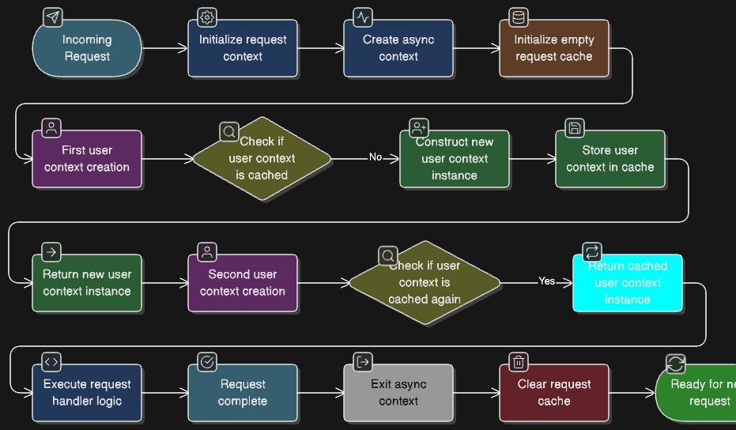

# Memoized Singleton Decorators

`@innobridge/memoirizedsingleton` is a lightweight dependency injection framework that caches decorated components and injects them by retrieving the cached instance. You define a component with a decorator, instantiate it once, and every subsequent resolution fetches the cached instance automatically.

## Table of Contents

1. [Overview](#overview)
2. [Decorators](#decorators)
	 - [`@Singleton`](#singleton)
	 - [`@Prototype`](#prototype)
	 - [`@Request`](#request)
	 - [`@Insert`](#insert)
3. [Qualifier Model](#qualifier-model)
4. [Nested Components](#nested-components)
5. [Lifecycle APIs](#lifecycle-apis)
6. [Architecture](#architecture)
7. [Tests](#tests)

## Overview

The framework is purpose-built for modern TypeScript projects that want simple dependency wiring without metadata emit requirements. Decorators wrap a class so it automatically registers itself with the application context on first construction and reuses the stored instance on subsequent resolutions.

## Decorators

### `@Singleton`

Creates one application-wide instance per qualifier. The default qualifier (`@Singleton`) stores the instance in an in-memory map.

```ts
import { Singleton } from '@/scopes/scopes';

@Singleton // default qualifier
class DefaultCache {}

@Singleton('secondary')
class SecondaryCache {}

const cacheA = new DefaultCache();
const cacheB = new DefaultCache();
const secondary = new SecondaryCache();

console.log(cacheA === cacheB);    // true
console.log(cacheA === secondary); // false
```

### `@Prototype`

Returns a brand-new instance every time you construct the decorated class while still letting
the container inject collaborators and apply lifecycle hooks. Prototype instances are never cached
in the application context, so each resolution is isolated.

Use `@Prototype` when you need container-managed wiring on short-lived objects:

- The instance holds per-invocation state (for example, a job processor or calculation helper).
- You want to keep using `@Insert`/qualifiers/AOP on that object without manually passing every dependency into its constructor.
- You still want access to the shared `Component` helpers (`getScope()`, `replace`, etc.) for debugging or testing.

If the class has no dependencies and no container features, a plain `new` without `@Prototype` is simpler.

A common pattern is to instantiate a prototype inside a longer-lived component while still letting the container satisfy the prototype's dependencies:

```ts
import { Prototype, Singleton } from '@/scopes/scopes';
import { Insert } from '@/building-blocks/assembler';

type JobPayload = { id: string };

@Singleton
class Logger {
	log(message: string) {
		console.log(`[logger] ${message}`);
	}
}

@Prototype
class TransientJob {
	@Insert(Logger)
	private logger!: Logger;

	handle(payload: JobPayload) {
		this.logger.log(`Processing ${payload.id}`);
		// ... stateful work lives only for this invocation
	}
}

@Singleton
class JobRunner {
	run(payload: JobPayload) {
		const job = new TransientJob(); // fresh instance every run
		job.handle(payload);
	}
}
```

Here `TransientJob` receives its collaborators via `@Insert` just like a singleton would, yet every `JobRunner.run` call gets an isolated `TransientJob` instance with its own temporary state.

### `@Request`

Creates one instance per qualifier **per asynchronous request** by storing the instance in `AsyncLocalStorage`.

```ts
import { Request } from '@/scopes/scopes';
import { initializeRequestContext } from '@/application-context/application_context';

@Request
class UserContext {
	constructor(public userId?: string) {}
}

@Request('admin')
class AdminContext {}

initializeRequestContext(() => {
	const defaultCtx = new UserContext('alice');
	const adminCtx = new AdminContext();

	console.log(defaultCtx === adminCtx); // false — different qualifiers
});
```

### `@Insert`

Field decorator that resolves dependencies from the cache when an owning class is constructed.

```ts
class Service {
	@Insert(Logger)
	logger!: Logger; // throws if missing

	@Insert(Logger, true)
	optionalLogger?: Logger; // remains undefined if Logger is absent

	@Insert(DatabaseConnection, false, 'primary')
	primaryDb!: DatabaseConnection;
}
```

Signature:

```ts
@Insert(DependencyCtor, optional?: boolean, qualifier?: string)
```

## Qualifier Model

Qualifiers map component constructors to a secondary key so multiple logical instances can coexist. The storage shape is:

```
Map<Constructor, Map<string, Component>>
```

Retrieve qualified instances explicitly with `getApplicationContext`:

```ts
import { getApplicationContext } from '@/application-context/application_context';

const defaultLogger = getApplicationContext(Logger);              // default qualifier
const secondaryLogger = getApplicationContext(Logger, 'secondary');
```

Prototype-scoped components are not cached in the container, so there is no dedicated cache for them, so `getApplicationContext(TransientWorker)` returns `undefined`.

## Nested Components

Components can depend on other components through `@Insert`, regardless of scope. For example, a singleton can inject another singleton and a request scoped component can inject a qualified service.

```ts
@Singleton
class Logger {}

@Singleton('primary')
class DatabaseConnection {
	constructor(public url: string) {}
}

@Singleton
class Repository {
	@Insert(Logger)
	private logger!: Logger;

	@Insert(DatabaseConnection, false, 'primary')
	private db!: DatabaseConnection;
}

@Request
class RequestMetadata {
	@Insert(Repository)
	repo!: Repository;
}
```

The injected instances respect their own scope. A request-scoped component receives the same singleton instance as every other consumer, while maintaining isolation for other request-scoped collaborators.

## Lifecycle APIs

Every decorated instance inherits lifecycle utilities from `Component`:

| Method | Description |
| ------ | ----------- |
| `getScope()` | Returns `SINGLETON`, `PROTOTYPE`, or `REQUEST`, useful for debugging and assertions. |
| `stop(qualifier?)` | Removes the current instance from the cache. The optional qualifier lets you target a specific entry. |
| `replace(newInstance, qualifier?)` | Swaps the cached instance with `newInstance` (optionally for a qualifier) and returns it. Handy for hot swapping in tests. |

Example:

```ts
const cache = new DefaultCache() as DefaultCache & Component;
cache.stop();                      // eviction

const altCache = cache.replace(new DefaultCache());
console.log(altCache === cache);   // false — new instance stored
```

## Architecture

### Storage Model

The framework maintains separate caches for singleton and request-scoped components using a nested map structure:

> Prototype-scoped components bypass these caches entirely; they are constructed on demand and discarded when no longer referenced.

```
┌─────────────────────────────────────────┐
│   Application Context (Singleton)       │
├─────────────────────────────────────────┤
│ Map<Constructor, Map<Qualifier, Inst>>  │
│                                         │
│  Logger ──┬─→ "default" ──→ Logger#1   │
│           └─→ "audit"   ──→ Logger#2   │
│                                         │
│  Cache  ──┬─→ "default" ──→ Cache#1    │
│           └─→ "redis"   ──→ Cache#2    │
└─────────────────────────────────────────┘

┌─────────────────────────────────────────┐
│   Request Context (AsyncLocalStorage)   │
├─────────────────────────────────────────┤
│ Map<Constructor, Map<Qualifier, Inst>>  │
│                                         │
│  UserCtx ──→ "default" ──→ UserCtx#A   │
│  AdminCtx ─→ "default" ──→ AdminCtx#A  │
└─────────────────────────────────────────┘
```

### Resolution Flow

When you construct a decorated class, the decorator intercepts construction and performs cache-or-create logic:

<details>
<summary>Resolution Flow (click to expand)</summary>


</details>


Prototype-scoped components are never cached, so there is no dedicated prototype cache. Each time a prototype dependency is injected, a new instance is created.

### Request Scope Lifecycle

Request-scoped components live within an async boundary created by `initializeRequestContext`:

<details>

<summary>Request Scope Lifecycle (click to expand)</summary>


</details>




### Dependency Injection Flow

`@Insert` resolves dependencies eagerly during class construction:

<details>

<summary>Dependency Injection Flow (click to expand)</summary>

```mermaid
flowchart LR
    A[Service constructed] --> B[@Insert decorator runs]
    B --> C{Check optional flag}
    
    C -->|Required| D[Get from cache]
    C -->|Optional| E[Try get from cache]
    
    D --> F{Found?}
    F -->|Yes| G[Inject instance]
    F -->|No| H[Throw error]
    
    E --> I{Found?}
    I -->|Yes| G
    I -->|No| J[Set undefined]
    
    G --> K[Property assigned]
    J --> K
    H --> L[Construction fails]
    
    style H fill:#f8d7da
    style G fill:#d4edda
    style J fill:#fff3cd
```

</details>


# Tests
```
npm run test:integration --file=env.test.ts
npm run test:integration --file=expressrequestscope.test.ts
npm run test:integration --file=insert.test.ts
npm run test:integration --file=requestscope.test.ts
npm run test:integration --file=singletonscope.test.ts
npm run test:integration --file=prototypescope.test.ts
```
